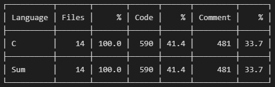

# TankGame - Task 01
Tank game written in C language.

> This code is developed in VSCode (Windows - WSL[Ubuntu]). Please open it with 
> VSCode if the indentation is not working on other editors. Windows style line
> endings may affect the indentation of the code.

Task 01 Highlights:
- Code comments (short & concise)
- Function header comments (short & concise)
- Modularization of the code (Short functions), 40-60 max lines of code
- Line width (100 char max)
- Use of #define constants in macros.h (nothing is hard-coded elsewhere)
- Use of function pointers
- Proper indentation of the code
- Argc handling errors are handled
- Low cyclomatic complexity of the code
- No multiple returns, global variables
- No break, continue statements inside loops (switch statements are allowed)
- No code duplication
- Debug prints are all surrounded by #ifdef DEBUG (no debug prints in release)
- Header file usage (logical grouping of functions into headers)
- Static functions (all methods not listed in headers must be static)
- Meaningful variable names and function names (the name itself indicates what it does without comments)
- Input validation according to the assignment specification
- Minimum number of mallocs (very low probability of memory leaks)
- 0 warnings, 0 errors during the compilation of the code
- Valgrind (0 memory leaks, 0 errors) during gameplay & initial stage of validating input
- Zero crashes (should meet all assignment spec requirements)
- Makefile dependencies are correctly listed (non-dependant headers not included)
- Performance improvement (Refer PERF comment) - Optional

## Code Stats

## Demonstration

---

# TankGame - Task 02

Task 02 Highlights:
- All Task 01 Highlights
- Object arrays (enemy, player, bullet) are now converted to structs
- Array indexing for object arrays is eliminated
- All game related configs are read from a configuration file
- Linked list debug logs to detect all malloced memory has been freed
- File handling errors (file not exists, etc) are handled
- Valgrind (0 memory leaks, 0 errors) during gameplay & initial stage of validating input
- Zero crashes (should meet all assignment spec requirements)
- Makefile dependencies are correctly listed (non-dependant headers not included)

## Code Stats

## Demonstration
